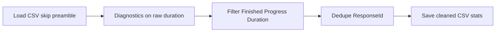

# Phase 1: Survey data cleaning script

## Context from your actual file

- Path: [`/Users/scottdavis/Desktop/AI Driven SDL Research/survey_results.csv`](/Users/scottdavis/Desktop/AI%20Driven%20SDL%20Research/survey_results.csv)
- **Qualtrics preamble**: Row 1 is the real header (`StartDate`, `Progress`, `Duration (in seconds)`, `Finished`, `ResponseId`, …). Rows immediately after contain the second header row and long question/consent text (multiline CSV fields). **Response rows start later** (first ISO-datetime lines appear around file line ~107). A fixed `skiprows=N` works for this file but is fragile if Qualtrics changes export options; the script should **detect the first data row** (line starts with `YYYY-MM-DD`) and skip everything between header and that row.
- **Columns**: `Finished` appears as `True`/`False` strings; `Progress` is numeric; `Duration (in seconds)` must be parsed as numeric.
- **ResponseId** is present (`R_…`), suitable for duplicate removal.

## Implementation approach

### 1) Load data (`pd.read_csv`)

- Use `encoding="utf-8"` (fallback `utf-8-sig` if needed).
- **Header**: first line only (`header=0`).
- **Skip preamble**: before `read_csv`, scan the file: after the header line, find the first line whose first field matches a datetime pattern (e.g. `^\d{4}-\d{2}-\d{2}`). Build `skiprows=range(1, first_data_line_index)` so rows between the header and first real response are skipped. This avoids hard-coding `105` and handles similar exports.
- **Robustness**: `low_memory=False`; `pd.to_numeric(..., errors="coerce")` for `Progress` and duration column; normalize `Finished` with a small helper that treats `True`/`TRUE`/`1` as true (case-insensitive).

### 2) Filter valid responses (your Step 2)

Keep rows where:

- `Finished` is truthy (after normalization)
- `Progress == 100` (allow float `100.0` via numeric compare)
- `Duration > 120` (after coercion; rows with invalid duration become NaN and drop out—optionally count them)

Print: initial row count, row count after filter, **removed count** and **retention %** vs initial.

### 3) Remove noise (your Step 3)

1. **Duplicates**: If `ResponseId` column exists and is non-null, `drop_duplicates(subset=["ResponseId"], keep="first")`. Else `drop_duplicates()` on full rows. Print how many duplicates removed.
2. **Duration**: Ensure a single numeric column (e.g. `Duration_sec`) via `pd.to_numeric` on `Duration (in seconds)`; keep original column or overwrite in-place for clarity in comments.
3. **Potential test entries (report only, no auto-drop)**:
   - **Very short (`< 60` s)** and **very long (`> 3600` s)**: After Step 2, durations `< 60` are already excluded by `Duration > 120`. To match the intent (“flag tests”), add a **diagnostic section on the loaded dataframe before Step 2** (or a copy): print counts and optionally a small preview (`head()`) of rows with `duration < 60` or `duration > 3600` for manual inspection. Separately, on the **post-filter** dataset, print any rows still `> 3600` s (legitimate slow completes) so you can eyeball outliers in the analysis sample.

### 4) Final dataset (your Step 4)

- Print **Final N**.
- Print **Duration** summary: mean, min, max (`describe()` or explicit aggregates; `min`/`max` skip NaN by default).
- Save **`cleaned_survey.csv`** next to the script by default, or use `argparse` / constants:
  - `INPUT_CSV` defaulting to your Desktop path
  - `OUTPUT_CSV` defaulting to `cleaned_survey.csv` in the script directory (or same folder as input—pick one and document in a comment).

### 5) Script quality

- `if __name__ == "__main__":` entrypoint.
- Section comments matching your Steps 1–5.
- Small helper functions: `normalize_finished`, `coerce_duration`, `load_qualtrics_csv(path)`, `print_step_stats(name, before, after)`.
- No automatic removal of long durations—only reporting.

## File to add

- **[`/Users/scottdavis/Survey Results/clean_survey_phase1.py`](/Users/scottdavis/Survey%20Results/clean_survey_phase1.py)** (name can be `survey_phase1_cleaning.py` if you prefer)—single script, no unrelated refactors.

## Optional dependency file

- If the project has no Python tooling yet, add a minimal **`requirements.txt`** with `pandas` (and pinned version only if you want reproducibility). Skip if you prefer documenting `pip install pandas` in the script docstring only.

## Data flow (high level)



## What you will run after approval

```bash
cd "/Users/scottdavis/Survey Results"
python clean_survey_phase1.py
# optionally: python clean_survey_phase1.py --input "/path/to/survey_results.csv" --output "./cleaned_survey.csv"
```
