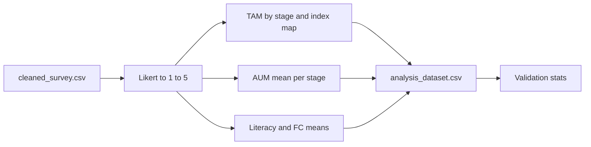

# Phase 2: Construct-level variables (Stage-Aware TAM + AUM)

## Data reality vs. generic naming

Your [`cleaned_survey.csv`](/Users/scottdavis/Survey%20Results/cleaned_survey.csv) uses **Qualtrics variable names**, not `PEOU_plan_1`:

| Stage key | Column prefix in CSV |
|-----------|----------------------|
| `plan` | `Planning_` |
| `design` | `Design_` |
| `implementation` | `Impl_` |
| `testing` | `Testing_` |
| `deployment` | `Deployment_` |
| `maintenance` | `Maintenance_` |

TAM items: `{Prefix}_TAM_1` … (Planning has **4** items; all other stages have **3**). AUM items: `{Prefix}_AUM_1` … **`_3`** per stage.

From the survey’s question text (export row 101), **item index maps to TAM subconstruct** as:

- **Planning**: `TAM_1`→PEOU, `TAM_2`→PU, `TAM_3`→BI, `TAM_4`→AU.
- **Design, Implementation, Testing, Deployment, Maintenance**: `TAM_1`→PEOU, `TAM_2`→PU, `TAM_3`→AU only (**no BI item** in instrument for those stages).

So for non-Planning stages, **`BI_{stage}`** should be **all-NaN** (or omitted—prefer **include column with NaN** so schema matches your spec and is explicit).

**Literacy vs FC** columns are `Literacy_FC_1`–`Literacy_FC_5`. Labels indicate **1–3 = AI literacy**, **4–5 = facilitating conditions** (IDE resources / help). Implementation:

- `AI_Literacy` = row-wise mean of `Literacy_FC_1`, `_2`, `_3`.
- `Facilitating_Conditions` = row-wise mean of `Literacy_FC_4`, `_5`.

**AUM “six dimensions”** (structured_prompting, iterative_refinement, etc.) are **not** separate column families in the CSV—each stage has **three** `{Stage}_AUM_k` items that correspond to different dimensions by stage. Per your Step 6, **one composite per stage** is appropriate: `AUM_plan` = mean(`Planning_AUM_1`,`_2`,`_3`), etc. (Document in a comment that sub-dimension labels vary by stage.)

## Implementation file

Add **[`/Users/scottdavis/Survey Results/build_analysis_dataset.py`](/Users/scottdavis/Survey%20Results/build_analysis_dataset.py)** (or `survey_phase2_constructs.py`) with:

### Step 1–2: Load and inspect

- `pd.read_csv` default path: same directory as script or `argparse` `--input cleaned_survey.csv`.
- Print `len(df)` and **all column names** (`df.columns.tolist()` or loop).

### Step 3: Likert → numeric 1–5

- Helper `likert_to_numeric(series)`:
  - Already numeric → coerce with `pd.to_numeric(..., errors="coerce")`.
  - Strings: extract leading digit with regex `^(\d)` (handles `"5 - Strongly Agree"`, `"5 - Strongly Agree"` with unicode dash, etc.); map to 1–5; invalid → NaN.
- Apply to **all columns** that match `Literacy_FC_*`, `*_TAM_*`, `*_AUM_*` via regex (dynamic; no hand-listed item names).

### Step 4–5: TAM constructs per stage (loops + regex)

- Constant `stages` list as specified.
- Constant `STAGE_PREFIX` dict mapping each stage key → CSV prefix string (see table above).
- Constant `TAM_INDEX_TO_CONSTRUCT`: e.g. `{"Planning": {1: "PEOU", 2: "PU", 3: "BI", 4: "AU"}}` and a **default** `{1: "PEOU", 2: "PU", 3: "AU"}` for other prefixes.
- For each stage `s`:
  - Find columns with `re.match(rf"^{re.escape(prefix)}_TAM_(\d+)$", col)`.
  - Group by construct name; for each of PEOU, PU, BI, AU (if any items exist), `df[f"{construct}_{s}"] = df[group_cols].mean(axis=1, skipna=True)` (or `min_count=1` policy—use consistent `skipna` and document; typical is mean of available items with `skipna=True`).

Output column names: **`PEOU_plan`, `PU_plan`, …** using **stage key** `plan`, not `Planning`.

### Step 6: AUM per stage

- Regex `^{prefix}_AUM_(\d+)$` for each stage; `AUM_{stage} = mean` of those three columns.

### Step 7: Global constructs

- `AI_Literacy` and `Facilitating_Conditions` as above from `Literacy_FC_*`.

### Step 8: Output DataFrame

- **ID**: `ResponseId` (and optionally `StartDate` if you want traceability—spec says “Respondent ID”; use **`ResponseId`** only to stay minimal).
- Concatenate: ID + all `PEOU_*`, `PU_*`, `BI_*`, `AU_*`, `AUM_*`, `AI_Literacy`, `Facilitating_Conditions`.
- Save **`analysis_dataset.csv`** (default next to script; `--output` flag).

### Step 9: Validation

- For each computed column: print **mean**, **std**, **count non-NaN**, **count NaN**.
- Optional: single `DataFrame.describe()` for computed block as a compact check.

## Dependencies

- Reuse existing [`requirements.txt`](/Users/scottdavis/Survey%20Results/requirements.txt) (`pandas` already listed).

## Optional project doc

- Copy a short **method note** into [`plans/`](file:///Users/scottdavis/Survey%20Results/plans/) (e.g. `stage_tam_aum_mapping.md`) documenting TAM index→construct mapping and Literacy_FC split—only if you want it versioned with the repo (optional).

## Validation flow

