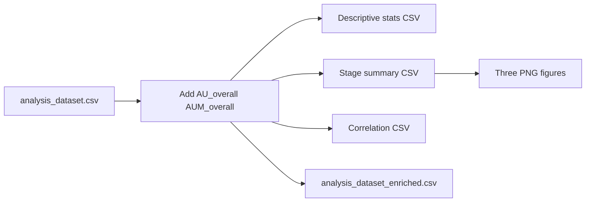

# Phase 3: Descriptive analysis, figures, and correlations

## Inputs and outputs

- **Input**: `[analysis_dataset.csv](/Users/scottdavis/Survey%20Results/analysis_dataset.csv)` — columns match the Phase 2 builder (e.g. `PEOU_plan`, `AU_implementation`, `AUM_maintenance`, `AI_Literacy`, `Facilitating_Conditions`).
- **New script** (recommended name): `[/Users/scottdavis/Survey Results/survey_phase3_analysis.py](/Users/scottdavis/Survey%20Results/survey_phase3_analysis.py)`
- **Artifacts** (same directory as input by default, or configurable `--output-dir`):
  - `descriptive_statistics.csv`
  - `stage_level_summary.csv`
  - `correlation_matrix.csv`
  - `analysis_dataset_enriched.csv` (original columns + `AU_overall`, `AUM_overall`)
  - `usage_by_stage.png`, `aum_by_stage.png`, `au_vs_aum.png` (dpi 300, `tight_layout`)

## Dependencies

- Add to `[requirements.txt](/Users/scottdavis/Survey%20Results/requirements.txt)`: `matplotlib`, `seaborn` (with reasonable lower bounds, e.g. `>=3.7`, `>=0.13`).

## Implementation outline (align with your steps)

### Step 1 — Load

- `pd.read_csv` with default path next to script (`Path(__file__).parent / "analysis_dataset.csv"`).
- Print `df.shape` and `df.columns.tolist()`.

### Step 6 — Derived variables (compute early)

- `stages = ["plan", "design", ...]` (loop-driven list as in your snippet).
- `au_cols = [f"AU_{s}" for s in stages]`, `aum_cols = [f"AUM_{s}" for s in stages]`.
- `AU_overall = df[au_cols].mean(axis=1, skipna=True)`; `AUM_overall` likewise — matches your requirement for row-wise means with NaN handled (`skipna=True`).

### Step 2 — Descriptive statistics

- Build column lists with **loops**: `peou_cols`, `pu_cols`, `au_cols`, `aum_cols`.
- **BI**: Only `[BI_plan](/Users/scottdavis/Survey%20Results/build_analysis_dataset.py)` has non-Nan values in this instrument; other `BI_*` are all-NaN. For a clean publishable table, include **only `BI_plan**` in the TAM BI row (as in your draft), or include all `BI_*` with explicit N — prefer `**BI_plan` only** to avoid meaningless NaN rows unless you want full schema visibility.
- Summary `DataFrame`: Variable, Mean, SD, N (`count()` per column); round to 3 decimals; print and save `descriptive_statistics.csv`.
- Optionally include `AU_overall` and `AUM_overall` in the same table (your draft does).

### Step 3 — Stage-level analysis (RQ2)

- Loop over `stages`: compute mean, SD, and N for `AU_{stage}` and `AUM_{stage}`.
- Output columns: at minimum **Stage, AU_mean, AUM_mean**; adding **AU_sd, AUM_sd, N_AU, N_AUM** (as in your draft) improves publishability.
- Save `stage_level_summary.csv` and print formatted.

### Step 4 — Visualization

- `sns.set_theme(style="whitegrid")` (or equivalent readable defaults).
- **Bar charts**: `sns.barplot` on `stage_summary_df` with `x=Stage`, `y=AU_mean` / `y=AUM_mean`; rotate x labels (~30°), axis labels, titles exactly as specified; `plt.savefig(..., dpi=300)` then `plt.close()`.
- **Scatter + regression**: `sns.regplot(x="AU_overall", y="AUM_overall", data=df, scatter_kws={"alpha": 0.7})`; title and axis labels as specified; save `au_vs_aum.png`.
- Use non-interactive backend-safe pattern (savefig/close) so runs headless.

### Step 5 — TAM relationships

- Build correlation matrix on: `PEOU_plan`, `PU_plan`, `BI_plan`, `AU_plan`, `AI_Literacy`, `Facilitating_Conditions`, `AU_overall`, `AUM_overall`.
- `df[corr_cols].corr()` (pairwise complete cases); round to 3 decimals; print and save `correlation_matrix.csv`.

### Step 7 — Basic insights

- Rank stages by `AU_mean` and `AUM_mean` from `stage_summary_df`.
- Print: highest/lowest AU stage, highest/lowest AUM stage (your draft includes both), Pearson `AU_overall` vs `AUM_overall`, and optional ranking tables for transparency.
- Closing message listing saved files.

### Code quality

- `argparse`: `--input`, `--output-dir` (default script directory).
- `if __name__ == "__main__":` entrypoint.
- Short module docstring referencing Phase 3.
- No edits to `[build_analysis_dataset.py](/Users/scottdavis/Survey%20Results/build_analysis_dataset.py)` unless a bug is found (not required for this phase).

## Data flow

